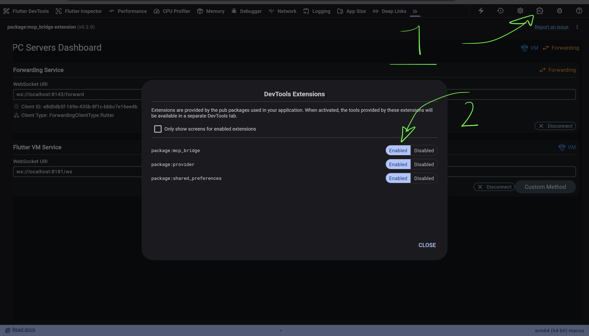
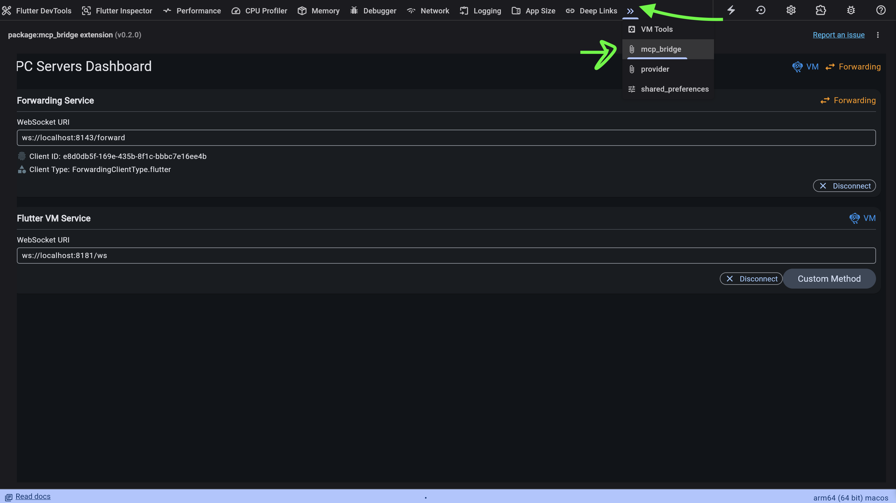

## 🚀 Quick Start

### Prerequisites

- Node.js (v14 or later)
- A Flutter app running in debug mode
- One of: Cursor, Claude, or Cline AI assistant

### Installing via Smithery (WIP)

To install Flutter Inspector for Claude Desktop automatically via [Smithery](https://smithery.ai/server/@Arenukvern/mcp_flutter):

```bash
npx -y @smithery/cli install @Arenukvern/mcp_flutter --client claude
```

### Installation from GitHub (Currently Recommended)

For developers who want to contribute to the project or run the latest version directly from source, follow these steps:

1. **Clone the repository:**

   ```bash
   git clone https://github.com/Arenukvern/mcp_flutter
   cd flutter-inspector
   ```

2. **Install and build dependencies:**

   ```bash
   make install
   ```

   This command installs all necessary dependencies listed in `package.json` and then builds MCP server and forwarding server.

3. **Start forwarding server:**

   ```bash
   make forward
   ```

4. **Add DevTools Flutter Extension to Flutter App:**

   ```bash
   flutter pub add --dev devtools_mcp_extension
   ```

5. **Start your Flutter app in debug mode**

   ! Current workaround for security reasons is to run with `--disable-service-auth-codes`. If you know how to fix this, please let me know!

   ```bash
   flutter run --debug --observatory-port=8181 --enable-vm-service --disable-service-auth-codes
   ```

6. **Open DevTools in Browser**

   Important part is to open DevTools in browser, and activate `mcp_bridge`.

   - For VSCode, run `cmd+shift+p` and search for `Open DevTools in Browser`.
   - Then go to `Devtools Extension` button (right corner of the window) and enable `mcp_bridge`.
     
   - Then open `mcp_bridge` tab and make sure everything is connected.
     

7. **🛠️ Add Flutter Inspector to your AI tool**

   **Note for Local Development (GitHub Install):**

   If you installed the Flutter Inspector from GitHub and built it locally, you need to adjust the paths in the AI tool configurations to point to your local `build/index.js` file. Refer to the "Installation from GitHub" section for instructions on cloning and building the project.

   #### Cline Setup

   1. Add to your `.cline/config.json`:
      ```json
      {
        "mcpServers": {
          "flutter-inspector": {
            "command": "node",
            "args": [
              "/path/to/your/cloned/mcp_flutter/mcp_server/build/index.js"
            ],
            "env": {
              "PORT": "3334",
              "LOG_LEVEL": "critical"
            },
            "disabled": false,
            "autoApprove": []
          }
        }
      }
      ```
   2. Restart Cline
   3. The Flutter inspector will be automatically available in your conversations

   #### Cursor Setup

   # ⚠️ Resources Limitations ⚠️

   - Since Cursor doesn't support resources, make sure you passed `RESOURCES_SUPPORTED=false` as environment variable. It will make some resources to be displayed as tools.

   1. Open Cursor's settings
   2. Go to the Features tab
   3. Under "Model Context Protocol", add the server:
      ```json
      {
        "mcpServers": {
          "flutter-inspector": {
            "command": "node",
            "args": [
              "/path/to/your/cloned/mcp_flutter/mcp_server/build/index.js"
            ],
            "env": {
              "RESOURCES_SUPPORTED": false
            },
            "disabled": false
          }
        }
      }
      ```
   4. Restart Cursor
   5. Open Agent Panel (cmd + L on macOS)
   6. You're ready! Try commands like "analyze my Flutter app's widget tree"

   #### Claude Setup

   1. Add to your Claude configuration file:
      ```json
      {
        "mcpServers": {
          "flutter-inspector": {
            "command": "node",
            "args": [
              "/path/to/your/cloned/mcp_flutter/mcp_server/build/index.js"
            ],
            "env": {
              "PORT": "3334",
              "LOG_LEVEL": "critical"
            },
            "disabled": false
          }
        }
      }
      ```
   2. Restart Claude
   3. The Flutter inspector tools will be automatically available
