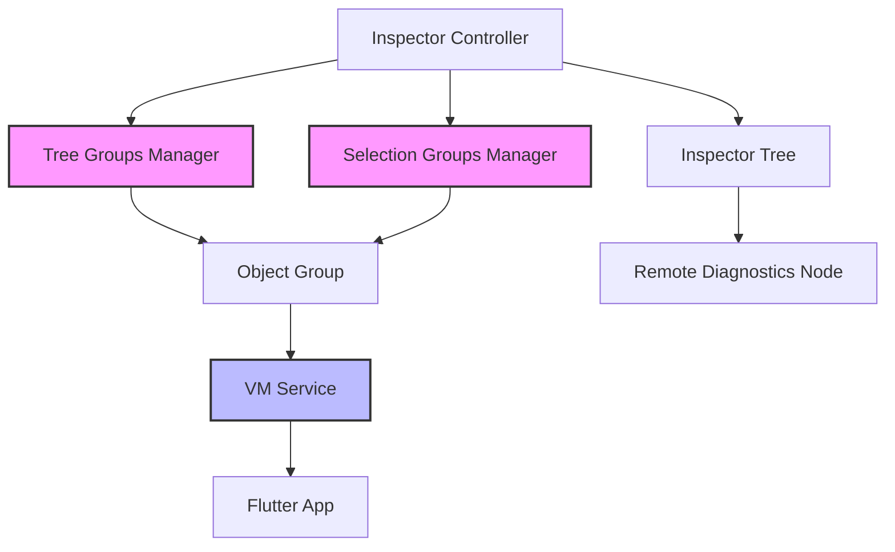
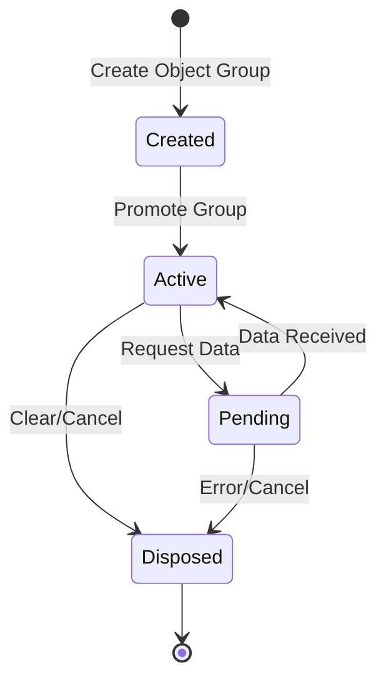

# Widget Tree Inspection Technical Documentation

## Overview

This document describes how to implement widget tree inspection and object group management for Flutter applications, based on the DevTools implementation. The system allows for efficient memory management while inspecting live Flutter widget trees.

## Table of Contents

1. [Core Concepts](#core-concepts)
2. [Architecture](#architecture)
3. [Implementation Details](#implementation-details)
4. [Memory Management](#memory-management)
5. [Implementation Guide](#implementation-guide)

## Core Concepts

### Widget Tree Inspection

Widget tree inspection allows developers to examine the structure of a Flutter application at runtime. It provides:

- Hierarchical view of widgets
- Properties of each widget
- Live updates as the app changes
- Memory-efficient inspection

### Object Groups

Object groups are a memory management pattern that:

- Groups related inspection objects together
- Provides atomic cleanup of resources
- Prevents memory leaks
- Manages lifecycle of inspection references

## Architecture

### System Components



### Object Lifecycle



## Implementation Details

### 1. Object Group Manager

The Object Group Manager maintains two key groups:

```dart
class ObjectGroupManager {
  ObjectGroup? _current;  // Active group
  ObjectGroup? _next;     // Pending group

  // Creates new group for next operation
  ObjectGroup get next {
    _next ??= createNewGroup();
    return _next!;
  }

  // Promotes pending group to current
  void promoteNext() {
    clearCurrent();
    _current = _next;
    _next = null;
  }
}
```

**Key Concepts:**

- Maintains two groups for atomic transitions
- Handles cleanup of old groups
- Manages group lifecycle

### 2. Tree Retrieval Process

The tree retrieval process follows these steps:

1. **Initialization**

```dart
// Create managers for different purposes
_treeGroups = ObjectGroupManager('tree');
_selectionGroups = ObjectGroupManager('selection');
```

2. **Request Tree**

```dart
Future<DiagnosticsNode?> getWidgetTree() async {
  final group = _treeGroups.next;
  try {
    // Request root widget tree
    final node = await group.getRoot(
      type: FlutterTreeType.widget,
      isSummaryTree: true
    );

    if (!group.disposed) {
      _treeGroups.promoteNext();
      return node;
    }
  } catch (e) {
    _treeGroups.cancelNext();
  }
  return null;
}
```

3. **Process Updates**

```dart
void handleTreeUpdate(DiagnosticsNode node) {
  // Process tree update
  updateTree(node);
  // Schedule next update if needed
  scheduleNextUpdate();
}
```

## Memory Management

### Object Group Lifecycle

1. **Creation**

```dart
class ObjectGroup {
  final String groupName;
  bool disposed = false;

  // Create new group with unique name
  ObjectGroup(String debugName) :
    groupName = '${debugName}_${generateUniqueId()}';
}
```

2. **Usage**

```dart
// Example of using object group
async function inspectWidget() {
  final group = objectGroupManager.next;
  try {
    await group.inspect();
    objectGroupManager.promoteNext();
  } catch (e) {
    objectGroupManager.cancelNext();
  }
}
```

3. **Cleanup**

```dart
void dispose() {
  // Clear all references
  disposed = true;
  // Release VM resources
  releaseResources();
}
```

## Implementation Guide

### Step 1: Setup Basic Structure

```dart
class WidgetInspector {
  late final ObjectGroupManager treeGroups;
  late final ObjectGroupManager selectionGroups;

  Future<void> initialize() async {
    treeGroups = ObjectGroupManager('tree');
    selectionGroups = ObjectGroupManager('selection');
    await setupVMService();
  }
}
```

### Step 2: Implement Tree Retrieval

```dart
class TreeRetriever {
  Future<WidgetTree?> getTree() async {
    final group = treeGroups.next;
    try {
      final root = await requestTreeFromVM(group);
      if (root != null) {
        treeGroups.promoteNext();
        return buildTree(root);
      }
    } catch (e) {
      handleError(e);
    }
    return null;
  }
}
```

### Step 3: Handle Updates

```dart
class TreeUpdater {
  void handleUpdate() {
    // Rate limit updates
    static const updateInterval = Duration(milliseconds: 200);

    if (!canUpdate()) return;

    scheduleUpdate(() async {
      final tree = await getTree();
      if (tree != null) {
        updateUI(tree);
      }
    });
  }
}
```

## Best Practices

1. **Memory Management**

   - Always dispose of object groups when done
   - Clear references in proper order
   - Handle disposed states in async operations

2. **Error Handling**

   ```dart
   Future<void> safeOperation() async {
     try {
       await operation();
     } catch (e) {
       if (e is VMServiceException) {
         handleVMError(e);
       } else if (e is DisposedException) {
         handleDisposed(e);
       }
       rethrow;
     }
   }
   ```

3. **Performance**
   - Implement rate limiting for updates
   - Use lazy loading for tree nodes
   - Cache frequently accessed data
   ```dart
   class RateLimiter {
     static const maxUpdatesPerSecond = 30;
     DateTime lastUpdate = DateTime.now();

     bool canUpdate() {
       final now = DateTime.now();
       if (now.difference(lastUpdate).inMilliseconds > (1000 / maxUpdatesPerSecond)) {
         lastUpdate = now;
         return true;
       }
       return false;
     }
   }
   ```

## Common Pitfalls and Solutions

1. **Memory Leaks**

   - Problem: Not disposing of object groups
   - Solution: Implement proper disposal chain

   ```dart
   void cleanup() {
     treeGroups.dispose();
     selectionGroups.dispose();
     clearReferences();
   }
   ```

2. **Race Conditions**

   - Problem: Async operations on disposed groups
   - Solution: Check disposal state

   ```dart
   Future<void> safeOperation() async {
     if (isDisposed) return;
     try {
       await operation();
       if (isDisposed) return;
       processResult();
     } catch (e) {
       handleError(e);
     }
   }
   ```

3. **Performance Issues**
   - Problem: Too frequent updates
   - Solution: Implement rate limiting
   ```dart
   class UpdateScheduler {
     Timer? _updateTimer;

     void scheduleUpdate(VoidCallback callback) {
       _updateTimer?.cancel();
       _updateTimer = Timer(
         Duration(milliseconds: 100),
         callback,
       );
     }
   }
   ```

## References

This implementation is based on the Flutter DevTools inspector implementation. While the original code is more complex and handles many edge cases, this documentation provides a simplified but production-ready approach to implementing widget tree inspection.

For the complete implementation details, you can refer to:

- [Inspector Controller Implementation](https://github.com/flutter/devtools/blob/master/packages/devtools_app/lib/src/screens/inspector/inspector_controller.dart)
- [Object Group Manager Implementation](https://github.com/flutter/devtools/blob/master/packages/devtools_app/lib/src/shared/diagnostics/inspector_service.dart)

## Conclusion

This document provides a comprehensive guide to implementing widget tree inspection with proper memory management. By following these patterns and best practices, you can create a robust inspection system that efficiently manages memory and provides reliable widget tree inspection functionality.
